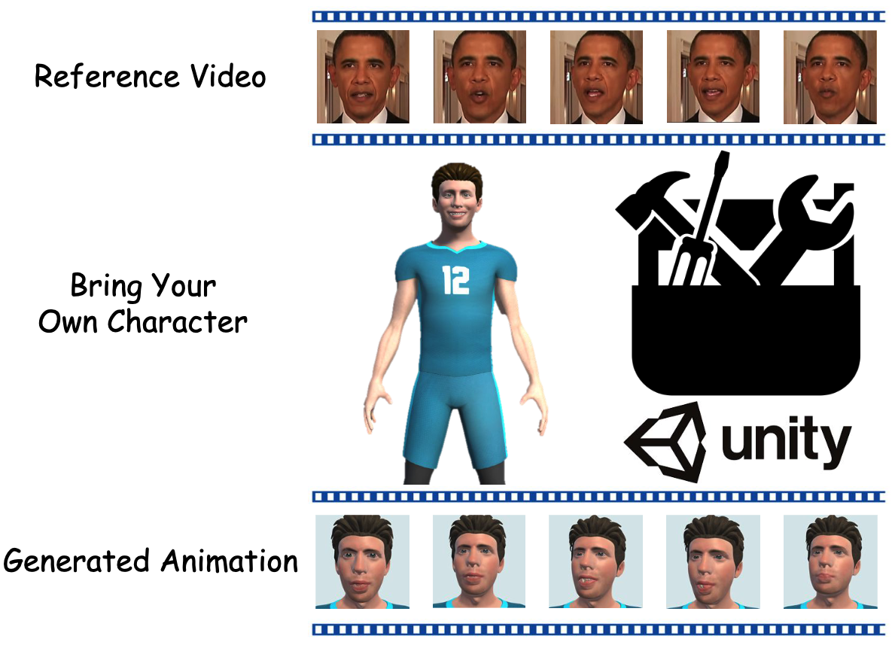

<h2 align="center"> <a href="https://arxiv.org/abs/2402.13724">Bring Your Own Characters: A Holistic Solution for Automatic Facial Animation Generation of Customized Characters</a></h2>

This repository is the official implementation of [**Bring Your Own Characters**](https://arxiv.org/abs/2402.13724) published in IEEE-VR 2024.

<p align="center" width="100%">
<a target="_blank"></a>
</p>

## Introduction

- **BYOC** is a holistic solution for creating facial animations of virtual human in VR applications. This solution incorporates two key contributions: 
  - (1) a deep learning model that transforms human facial images into desired blendshape coefficients and replicate the specified facial expression.
  - (2) a Unity-based toolkit that encapsulates the deep learning model, allowing users to utilize the trained model to create facial animation when developing their own VR applications.
- We also conduct a user study, collecting feedback from a wide range of potential users. It would inspire more future works in this direction.


## Setup

### Environment
```
git clone https://github.com/showlab/BYOC
cd BYOC
conda create -n byoc python=3.8
conda activate byoc
pip install torch==1.12.1+cu113 torchvision==0.13.1+cu113 torchaudio==0.12.1 --extra-index-url https://download.pytorch.org/whl/cu113
pip install -r requirements.txt
```

### Download Models and Files
**Pre-traind Base Model**
- Go to [google drive](https://drive.google.com/file/d/1sgf4vBB1PVKOnceIlo_ytFFjNtYtecZk/view?usp=sharing) to download the pre-trained model.
- Put the downloaded file at `./image2bs/landmark2exp/checkpoints/facerecon.`.

**Dependent Data**
- Go to [google drive](https://drive.google.com/file/d/1QyeFjtd0VQFGTOmxJIjpZyyGB0IOTe6B/view?usp=sharing) to download the essential files.
- Unzip and put the `BFM` folder at `./image2bs/landmark2exp`.

**File Structure**
- `training` folder is a training workspace for you to train the Adapter model on your customized dataset.
- `image2bs` folder is an inference workspace for you to debug the full inference pipeline of Base Model + Adapter Model, and test the performance of your trained model.
- `BlendshapeToolkit` is a project of Unity that implements the toolkit with rich user interface.


## Training

### Prepare Dataset

**Option 1: Try the training dataset provided by us**
1. Go to [google drive](https://drive.google.com/file/d/1h3Buteaz3KiNAOo9HW4r-_T0P90mUnKs/view?usp=sharing) to download the training dataset.
2. Put `blendshape_gt.json` at `./training/Deep3DFaceRecon_pytorch/datasets`
3. Put `test_images` at `./training/Deep3DFaceRecon_pytorch/checkpoints/facerecon/results/`

**Option 2: Prepare the training dataset by yourself**
1. Run the script `./training/construct_dataset/random_blendshape_weights.py` to generate customized dataset.
2. Put the generated `./training/construct_dataset/blendshape_gt/xxxx.csv` into `MAYA Software` to generate training images.
3. Put the generated training images into `./image2bs/test_images` and run the script `./image2bs/process_training_dataset.py`
4. Put `./training/construct_dataset/blendshape_gt.json` into `./training/Deep3DFaceRecon_pytorch/datasets`
5. Put `./image2bs/landmark2exp/checkpoints/facerecon/results/test_images` into `./training/Deep3DFaceRecon_pytorch/checkpoints/facerecon/results/`

### Start Training!
1. Run `bash train.sh` to train the model.
2. Run the command `python -m visdom.server -port 8097` to start visualization of training.


## Inference (Python)
1. Put the pretrained_model `latest_net_V.pth` into `./image2bs/exp2bs/checkpoint/EXP2BSMIX/Exp2BlendshapeMixRegress`.
2. Put your video into `./image2bs/test_video` or put images into `./image2bs/test_images`.
3. Run the script `inference.py` to inference only.


## Usage (Unity)
1. In the `image2bs/inference.bat` file, (1) change `e:` on the second line to the disk partition name where `image2bs` is located, such as `d:`. (2) Change the path following `cd` on the third line to the absolute path of the `image2bs` folder. (3) Change `PYTHON_PATH` to the absolute path of the folder containing the Python interpreter used for `inference`. (4) Change `INF_PATH` to the absolute path of the `image2bs` folder.
2. Start the `BlendshapeToolkit` with Unity and run the project.
3. Click the `Initialize` button to call `image2bs` project to generate animation. For more details about usage of the toolkit, please refer to our paper.


## Acknowledgement
We are grateful for the following awesome projects:
* [Deep3DFaceRecon_pytorch](https://github.com/sicxu/Deep3DFaceRecon_pytorch)
* [pix2pix](https://github.com/phillipi/pix2pix)


